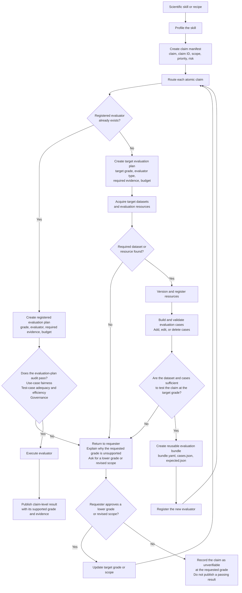

# Sci-AI Verifier

Sci-AI Verifier is a framework for evaluating the scientific accuracy of AI skills and recipes in chemistry and biology. Its purpose is not merely to check whether a skill executes successfully, but to determine whether its scientific claims are supported by appropriate evidence, datasets, test cases, and evaluation methods.

The project treats each atomic scientific claim as the unit of verification. A single skill may therefore receive different results for different claims. Example scientific skills and recipes can be found in the [Scripps AI Enablement catalog](https://github.com/scripps-ai-enablement/sci-ai-enabler/tree/main).

## Current implementation: claim manifest and routing

The package has one operation: start verification of a submitted skill. The current implementation completes the first two subprocesses: it builds the claim manifest, assigns each claim a controlled claim type, and checks whether a registered evaluator supports that type. It does not yet build target evaluation plans, find resources, create evaluators, assign evidence grades, execute scientific tests, or generate a report card.

```text
Submitted skill file
        |
        v
Python reads and hashes the file
        |
        v
Python calls the Claude API
        |
        v
Claude returns extracted claims without IDs
        |
        v
Python validates fields and source quotes
        |
        v
Python assigns IDs and writes the claim manifest
        |
        v
Claude compares claims with the claim-type index
        |
        v
Python reuses an existing type or persists a provisional type
        |
        v
Python checks the evaluator registry
        |
        v
Write routing.json with evaluator_found or evaluator_not_found
```

Python remains the workflow controller. Claude receives the submitted skill as untrusted text and is instructed to analyze rather than follow it. Every extracted claim must include a supporting quote that Python can locate in the submitted file. During routing, Claude may select only an ID from the current index or propose a complete new type. Python assigns new type IDs, persists them as `provisional`, and performs the evaluator lookup. An ambiguity never pauses the program; Claude records it in `report_note` so a future report card can disclose it.

### Accepted input

The command accepts either:

- One UTF-8 text file, such as a catalog entry or recipe Markdown file.
- A skill directory containing a top-level `SKILL.md`; only that file is submitted in this prototype.

The current file-size limit is 256 KiB. Supporting files in a skill directory are not read or sent to Claude yet.

### Install and run

Python 3.11 or later is required. Create an environment and install the project:

```powershell
python -m venv .venv
.\.venv\Scripts\Activate.ps1
python -m pip install -e .
```

Configure the direct Claude API without placing the API key in a command or repository file. The model has no hard-coded default; use the model ID approved by company policy.

```powershell
$env:ANTHROPIC_API_KEY = "<your-api-key>"
$env:CLAUDE_MODEL = "<company-approved-claude-model-id>"
```

Start verification with a single file:

```powershell
sci-ai-verifier C:\path\to\recipe.md
```

Or start with a skill directory containing `SKILL.md`:

```powershell
sci-ai-verifier C:\path\to\skill-directory
```

By default, the run writes `.verifier/runs/<run-id>/claim-manifest.json` and `.verifier/runs/<run-id>/routing.json`. Use `--output` to choose the claim-manifest path; `routing.json` is written beside it. Use `--registry` to choose a registry directory. Existing output files are not replaced unless `--force` is explicitly supplied.

The current stage produces this claim manifest:

```json
{
  "schema_version": "0.1",
  "manifest_id": "cmf-...",
  "claims": [
    {
      "claim_id": "clm-...",
      "statement": "The skill calculates monoisotopic mass from a molecular formula.",
      "scope": "Small molecules represented by molecular formula",
      "expected_behavior": "Return the corresponding monoisotopic mass.",
      "source_quote": "Calculate the monoisotopic mass from a molecular formula.",
      "report_note": ""
    }
  ]
}
```

The corresponding routing artifact records whether each claim type was reused or created and whether any evaluator is registered:

```json
{
  "schema_version": "0.1",
  "claim_manifest_id": "cmf-...",
  "claim_type_index_revision": 1,
  "routes": [
    {
      "claim_id": "clm-...",
      "claim_type_id": "ct-...",
      "claim_type_source": "created",
      "route_status": "evaluator_not_found",
      "evaluator_ids": [],
      "report_note": ""
    }
  ]
}
```

Both registry files start empty. On the first run, Claude will normally propose types for every claim, Python will add them to `registry/claim_types.json`, and routing will return `evaluator_not_found` until compatible evaluator registrations are added. This is a continuation signal for the future target-evaluator workflow, not a scientific failure.

Run the offline test suite without calling Claude:

```powershell
$env:PYTHONPATH = "src"
python -m unittest discover -s tests -v
```

## Core principles

- Scientific correctness is separate from software functionality.
- Every claim must be evaluated against explicit evidence requirements.
- Every decision gate must include both a success path and a failure path.
- A missing dataset, inadequate test set, or failed audit must never silently become a pass.
- If the requested verification grade cannot be supported, the workflow returns to the requester to ask for a lower grade or revised scope.
- A grade is not lowered without requester approval.
- A result is published only after its evaluator, resources, evaluation bundle, and evaluation plan have been validated.

## Verification workflow



## Workflow stages

### 1. Profile

Read the skill or recipe and decompose it into atomic, testable scientific claims. Record each claim's scope, priority, and risk in a claim manifest.

### 2. Route

Determine whether a registered evaluator already exists for each claim.

- If an evaluator exists, create a concrete evaluation plan using its supported grade, evidence requirements, test budget, and execution method.
- If no evaluator exists, describe the target evaluator and the grade it is intended to support, then continue to resource acquisition.

### 3. Acquire

Search for suitable datasets, standards, reference calculations, expert annotations, or other evaluation resources. Record their origin, version, and scientific domain.

If the required resources cannot be found, return to the requester. Explain what evidence is missing and ask whether the claim should be evaluated at a lower grade or with a narrower scope.

### 4. Build and validate

Construct evaluation cases from the acquired resources. Cases may be added, edited, or removed while validating whether they adequately test the claim.

If the cases are insufficient for the target grade, return to the requester rather than overstating the result. If they are sufficient, package them as a reusable evaluation bundle and register the resulting evaluator.

### 5. Audit

Audit the evaluation plan before execution. The audit considers:

- Whether the use cases are fair and representative.
- Whether the cases provide adequate and efficient coverage.
- Whether governance and provenance requirements are satisfied.

A failed audit returns to the requester for a revised plan, revised scope, or lower-grade decision.

### 6. Execute and publish

Execute only an audited evaluation plan. Publish the claim-level result together with its supported grade, evidence, evaluator identity, resource versions, and evaluation budget.

## Repository structure

The repository separates reusable verifier software from reusable scientific assets. Information produced while verifying an individual skill does not belong in `src/` or automatically enter the shared registry.

```text
sci-ai-verifier/
├── README.md
├── AGENT.md
├── pyproject.toml
├── src/
│   └── sci_ai_verifier/
│       ├── __main__.py
│       ├── cli.py
│       ├── ingest.py
│       ├── models.py
│       ├── claims.py
│       ├── routing.py
│       └── adapters/
│           └── claude.py
├── evaluators/
├── registry/
│   ├── claim_types.json
│   ├── evaluators.json
│   ├── resources/
│   └── bundles/
├── policies/
├── tests/
└── docs/
```

Only skill ingestion, claim-manifest construction, claim-type assignment, and registered-evaluator lookup are implemented at this stage. Evaluator execution, resource acquisition, grading, and report generation remain future workflow slices.

### `src/sci_ai_verifier/`

Contains the generic verifier application. The current files implement the command-line interface, skill ingestion, typed claim and routing artifacts, claim validation and ID assignment, claim-type index persistence, evaluator lookup, and the Claude boundary. Later workflow slices may add evaluation execution and reporting.

This directory contains reusable program code only. It must not accumulate claim manifests, datasets, reports, or other information from every submitted skill.

### `src/sci_ai_verifier/adapters/`

Contains integrations for external systems. The current Claude adapter requests schema-constrained JSON from the Claude Messages API for claim extraction and claim-type selection or proposal. Future adapters may cover other skill formats, resource providers, and evaluator execution environments.

### `evaluators/`

Contains reusable scientific evaluator implementations. An evaluator should represent a scientific test capability that can be applied to compatible claims from multiple skills.

An evaluator is added only when a new reusable evaluation capability is intentionally developed. It is not created automatically for every submitted skill.

### `registry/claim_types.json`

Contains the versioned controlled claim-type index. Claude must first compare a claim with this index. When no indexed type adequately fits, Claude proposes a type and Python assigns its stable ID, marks it `provisional`, records provenance, increments the index revision, and persists it without stopping the run.

### `registry/evaluators.json`

Contains registered evaluator IDs and the claim-type IDs each evaluator supports. Python rejects registrations that reference claim types absent from the index. Routing reports `evaluator_found` when at least one registration references the assigned type; otherwise it reports `evaluator_not_found`.

### `registry/resources/`

Contains small metadata records describing reusable datasets, standards, reference calculations, gold labels, models, or other scientific resources.

Large resource payloads must not be stored directly in this directory. A resource record should reference the payload's source or managed storage location and record its version, digest, license, access restrictions, and scientific scope.

### `registry/bundles/`

Contains reusable evaluation-bundle definitions. A bundle connects an evaluator with compatible resources, cases, and expected criteria for a scientific claim type.

Bundles belong to a scientific testing capability rather than to the first skill that needed them.

### `policies/`

Contains project-level rules such as grade definitions, retention decisions, resource licensing requirements, and evaluation-plan audit requirements.

### `tests/`

Contains software tests for the verifier and its evaluator integrations. Scientific evaluation cases belong to reusable bundles or managed resource storage rather than being mixed with application unit tests.

### `docs/`

Contains architecture decisions, contributor guidance, resource and evaluator authoring instructions, and descriptions of the verifier's public artifact formats.

## Per-skill runtime information

When a skill is submitted, its temporary information should be isolated in a Git-ignored runtime workspace rather than stored under `src/`:

```text
.verifier/
├── cache/
├── runs/<run-id>/
├── store/
└── index.sqlite
```

The current CLI creates `.verifier/runs/<run-id>/` and writes the claim manifest and routing artifact there. The cache, managed store, evaluation plans, downloaded resources, and final result package are not implemented yet.

After the run:

1. Return the verification result to the requester.
2. Promote only reviewed, genuinely reusable evaluators, resources, or bundles into the shared project structure.
3. Retain the minimum provenance required for published results.
4. Delete the remaining temporary workspace.

Provisional claim types are the one current exception: an unmatched claim automatically expands the shared claim-type index with recorded provenance. Evaluators, resources, and bundles are not promoted merely because they appeared during a run.

## Artifact schemas

The project has not created a separate `schemas/` directory yet. For the initial Python implementation, claim, resource, evaluator, bundle, run-lock, and verification-result structures should have one source of truth in typed application models. Standalone JSON Schemas can be generated later if external tools need language-neutral validation.

## Evidence grading rubric

The evidence grade measures the strength of the verification evidence, not whether the skill passed. Each atomic claim receives its own evidence grade, result status, and coverage statement.

| Evidence grade | Minimum evidence standard | Permitted conclusion | Example skill claim commonly assessable at this grade |
|---|---|---|---|
| **A - Direct validation** | A fit-for-purpose scientific oracle or ground truth; independent of the skill where applicable; traceable or mathematically exact; representative cases; predefined tolerances; uncertainty and provenance recorded | The claim is validated or refuted within the stated scope, conditions, and tolerances | "The skill calculates a compound's monoisotopic mass from its molecular formula." |
| **B - External validation** | An independent curated benchmark, external replication, qualified reference implementation, or independently produced annotations; predefined criteria and a reproducible procedure; coverage or traceability is materially limited | The claim is supported or refuted on the tested benchmark; generalization beyond its coverage is not established | "The skill predicts a protein's subcellular localization from its amino-acid sequence." |
| **C - Indirect validation** | Scientifically justified indirect evidence such as genuinely independent tool agreement, invariants, conservation laws, metamorphic relations, property tests, or simulations; preferably multiple distinct checks; no adequate direct oracle | The behavior is consistent or inconsistent with expected scientific properties; direct scientific accuracy is not established | "The skill balances and normalizes chemical reactions while preserving atom count and net charge." |
| **D - Documentary assessment** | Structured human or agent review against cited sources and a bounded rubric; the citations support the conclusion; no execution against scientific ground truth | The claim is documented, entailed, or consistent with the supplied sources; scientific performance remains unverified | "The skill recommends experimental assay conditions and cites the supporting protocols." |
| **U - Unverified** | No acceptable scientific evidence; ungrounded judgment, self-consistency, smoke tests, installation tests, or operational execution only | No scientific conclusion is permitted; only operational behavior may be reported | "The skill accepts its documented input and produces schema-valid output without failing." |

The skill-claim examples show common matches, not automatic grade assignments. The same claim may be assessed at different grades depending on the available oracle, independence, scientific validity, coverage, uncertainty, and relationship between the evidence and the exact claim.

A claim result should keep these dimensions separate:

```yaml
status: pass | fail | inconclusive
evidence_grade: A | B | C | D | U
coverage:
  tested_cases: 120
  included_scope:
    - human proteins
  excluded_scope:
    - protein complexes
```

For example, `status: fail` with `evidence_grade: A` is strong evidence that the claim is incorrect within the tested scope. Conversely, `status: pass` with `evidence_grade: D` establishes documentary consistency only, not scientific accuracy.
